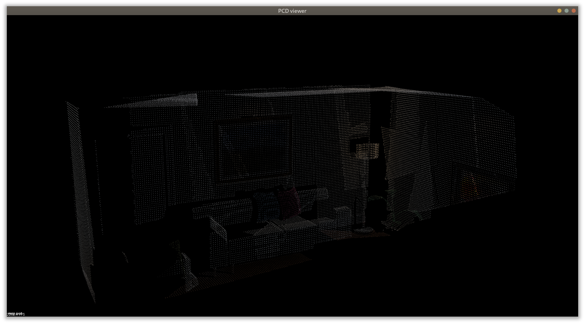
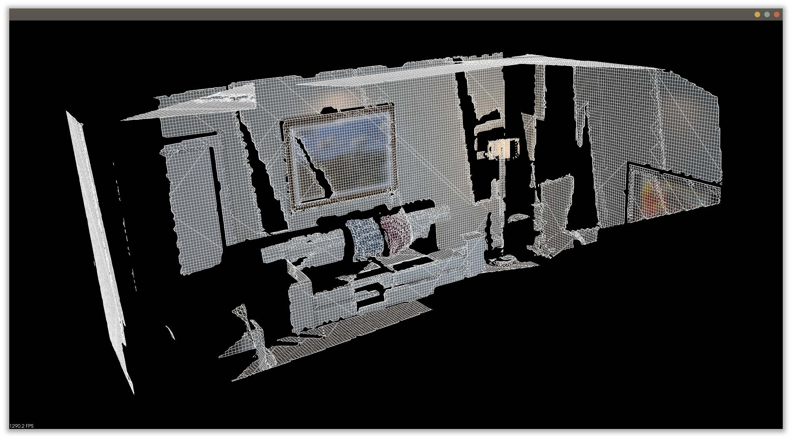
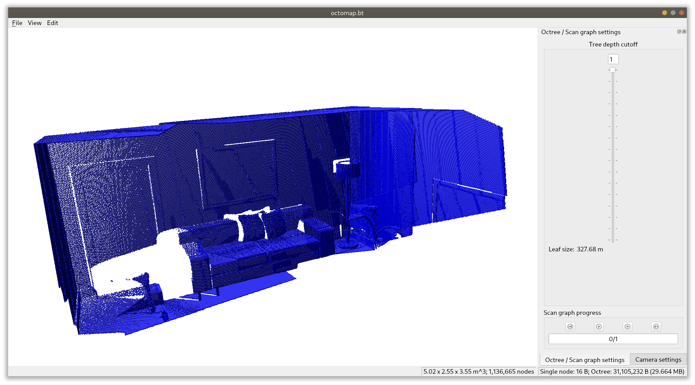

# 第十二講：建圖

主要目標：

1. 理解單目SLAM中稠密深度估計的原理

2. 通過實驗了解單目稠密重建的過程

3. 了解幾種RGB-D重建中的地圖形式。

## 概述

地圖的用處：

1. 定位: 稀疏地圖即可做到

2. 導航: 知道道路跟障礙物在哪裡，並規劃路線。

3. 避障: 跟導航一樣，只是更注重局部、動態障礙物的處理。

4. 重建: 給人看的，需要附上灰度或RGB訊息。想像玩遊戲時的畫面呈現。

5. 互動: 不管是人透過AR/VR或機器跟人/環境互動，都會需要更高級的物理/語義地圖。

除了第一點之外，2. 3. 4. 主要是稠密，5. 則需要更高階的理解。

## 單目稠密重建

### 立體視覺

用原本只能測角度的相機測深度:

1. 單目: SfM

2. 雙目: 視差法

3. RGB-D: 不管啦，用主動式的紅外光/聲納/光達直接獲得深度

### 極線搜索與塊匹配(block matching)

透過已知兩幀的姿態來得到某點於第二幀的極線並進行block matching。兩個image block的差異可以分成幾種方法:

1. SAD (Sum of Absolute Difference)

2. SSD (Sum of Squared Distance)

3. NCC (Normalized Cross Correlation)

(式子暫略)

也可再加上去均值的技巧減少曝光不定造成的整體灰度變化。

### 常態分佈的深度濾波

根據上述的差異公式來獲取平均值$\mu$跟變異數$\sigma^2$，並假設其沿距離d的分佈服從常態分佈。

隨著新的幀進來，進行式12.6的更新，觀察不確定性是否收斂，如果沒收斂就換第二個最可能的匹配點再算一次。或者直接跳過這幀也可以，看你要多準或多快。大概。

## 實踐：單目稠密重建

(照著範例code跑了一遍)

### 像素梯度的問題

可以只搜尋沿極線像素梯度高的點。

### 逆深度: 參數化問題

逆深度可以取得更好的結果，因為它直接假設假設極線在image space中服從常態分佈。

為什麼這樣假設就比較準？

### 圖像間的變換

在block matching之前先對新幀進行座標變換造成的仿射變換，減少相機旋轉造成的問題。

所謂的去旋轉(de-rotation)就是基於這種概念，只不過忽略了平移部份，避免假設深度這件苦差事。(我的觀察啦)

### 並行化：效率的問題

說GPU可以讓它變很快。

其實我最近是有點想研究GPU編程，具體來說是Vulkan Kompute。不知道有沒有機會當成Bonus研究研究。

### 其他可能的改進

1. 可假設相鄰像素深度變化不會太大

2. 引入outlier的概念

## RGB-D稠密建圖

### 實踐：點雲地圖

(照著範例跑了一遍)

### 從點雲重建網格

### 八叉樹地圖

## TSDF地圖和Fusion系列

用TSDF函數構建/更新一定範圍內的地圖。要用GPU。詳見習題。

## 習題

**推導式(12.6):**

$$
\mu_{fuse} = \frac{\sigma^2_{obs}\mu + \sigma^2\mu_{obs}}{\sigma^2 + \sigma^2_{obs}},\: 
\sigma^2_{fuse} = \frac{\sigma^2\sigma^2_{obs}}{\sigma^2 + \sigma^2_{obs}}
$$

**把本講的稠密深度估計成半稠密，你可以先把梯度明顯的地方篩選出來。**

**把本講演示的單目稠密重建代碼從正深度改成逆深度，並添加仿射變換。實驗效果是否有改進？**

**你能論證如何在八叉樹中進行導航或路徑規劃嗎？**

**研究參考文獻，探討TSDF地圖是如何進行位姿估計和更新的，它和我們之前講過的定位建圖算法有何異同？**

**研究均勻-高斯混合濾波器的原理與實現。**
